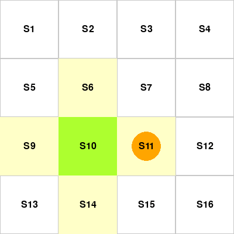
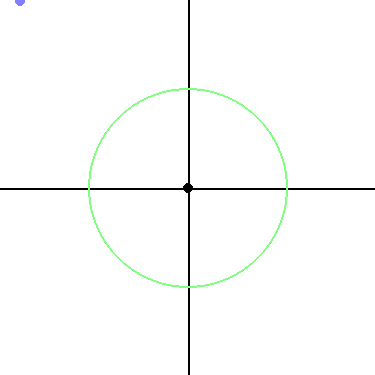
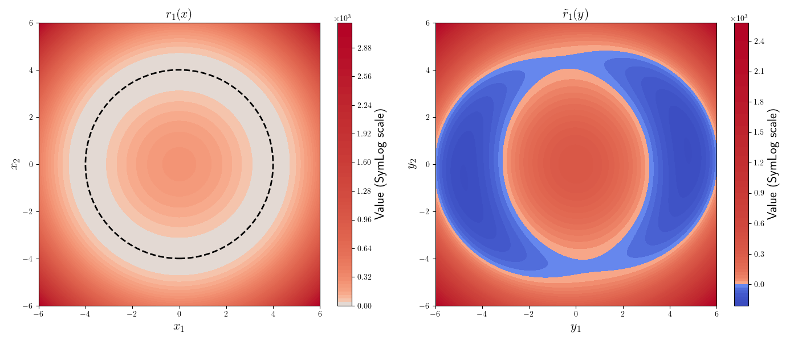
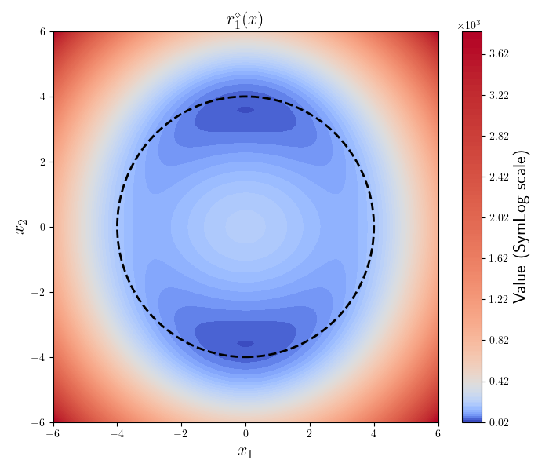

# RE-POMDP
Contains supplementary simulation code for the work:

```
Ran Wang and Kenji Kashima. 
"Deep reinforcement learning for static noisy state feedback control with reward estimation" 
Advanced Robotics (2024).(pending review).
```
## Install

```
pip install gymnasium
pip install stable-baselines3
```

## Simulation Results

|                                  |                                                |
| :------------------------------: | :--------------------------------------------: |
|         `NoisyGridworld-v0`          |                 `NoisyLimitCycle-v0`                 |
|  |                  |

In NoisyGridworld-v0, the green block depicts the state of the robot, the orange circle depicts the noisy state observation. The robot observes the true state with a probability of $0.4$ (denoted by $q$), observes a neighboring state with a probability of $\frac{1-q}{\text{number of neighbors}}$, and observes the other states with a probability of $0$. 

In NoisyLimitCycle-v0, the green circle depicts the target position, the blue dot depicts the true state, and the red dot depicts the noisy observation. Our purpose is to control the blue dot to the target position. 

With the learned policy, we can achieve the control objectives against the measurement noise.

## Reward Estimation
For NoisyLimitCycle-v0, we apply reward estimation technique. Note that a misunderstood reward function will lead to a wrong controller.
|  True reward function and  estimated reward function      |
| :-------: |
| 
| **The true reward function induced by the misunderstood reward function**          |        
| |
||


## Reference

[1] Raffin A, Hill A, Gleave A, et al. Stable-baselines3: Reliable reinforcement learning implementations. Journal of Machine Learning Research. 2021;22(268):1-8.

[2] https://github.com/RanKyoto/DE-SAC

